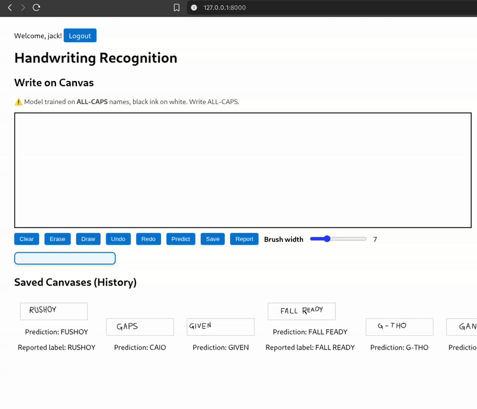
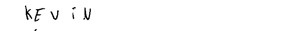
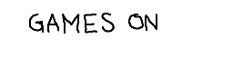

# CRNN_Handwriting_Recognition

# ✍️ Handwriting Recognition Web App

A **full-stack handwriting recognition system** built with **Django** and a custom-trained **CRNN (CNN + BiLSTM + CTC)** model.

## 🚀 Features
- 🖌️ Draw on HTML5 Canvas and get **real-time predictions**.
- 🔑 User Authentication (Login/Register).
- 💾 Save drawings to personal gallery.
- 📊 Report incorrect predictions (for dataset improvement).
- 🔄 Undo/Redo, Eraser, Brush width adjustment.
- 📂 Gallery view of saved canvases.

## 🧠 Model
- Custom **CRNN (Convolutional + Recurrent + CTC Loss)** trained on handwriting dataset.
- Characters supported: **A–Z, Apostrophe ('), Dash (-), Space**.
- Input preprocessing:
  - Resize → `256x64`
  - Grayscale → Normalize [0,1]
  - Rotate 90° CW
  - Add channel + batch dimensions

### Model Architecture
- **CNN Layers**: 32 → 64 → 128 filters with BatchNorm, ReLU, Dropout
- **BiLSTM Layers**: 2 × 256 hidden units
- **CTC Decoding** for variable-length sequence predictions
- Trained with **CTC loss** for robust alignment

## 🛠️ Tech Stack
- **Backend:** Django (Python)
- **Frontend:** HTML5 Canvas + JavaScript (Fetch API)
- **Deep Learning:** TensorFlow/Keras
- **Database:** SQLite (dev) / PostgreSQL (prod)

## 📂 Project Structure
handwriting-app/
│── predictor/
│ ├── views.py # Prediction, save, report
│ ├── models.py # Django models for gallery
│ ├── utils.py # Prediction helpers
│ └── model/best_model.h5
│── templates/
│ └── predictor/index.html # Main UI
│── static/
│ ├── js/canvas.js # (Optional, now inline in HTML)
│ └── css/style.css


## ⚡ Setup
```bash
git clone <repo-url>
cd handwriting-app
pip install -r requirements.txt

# Run migrations
python manage.py migrate

# Start server
python manage.py runserver
```

## Demo


